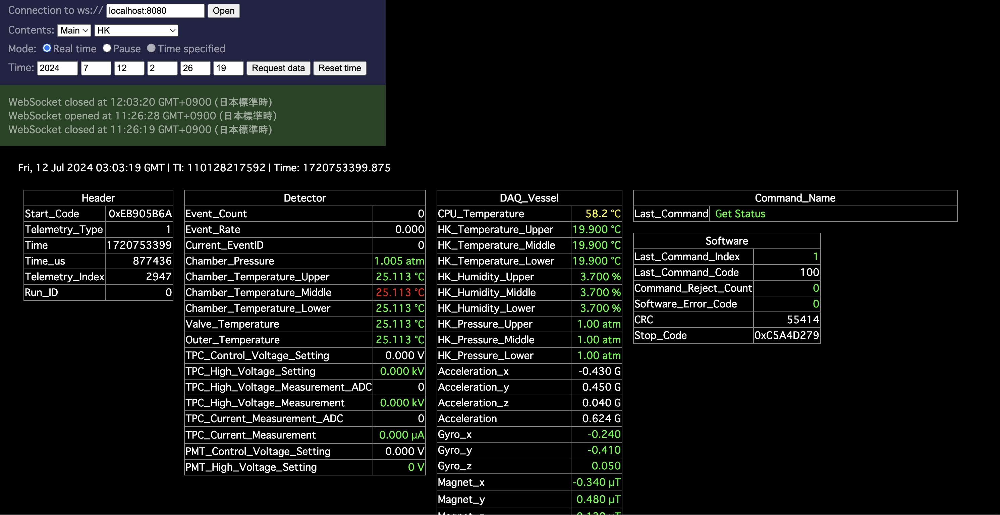

# Demo version of GRAMSBalloon

The onboard software in eGRAMS can be used on Raspberry Pi only, because it needs pigpio, which runs on RP.
To develop pGRAMS software on Mac PC, we developed demonstoration version of GRAMSBalloon (called GRAMSBalloonDemo or GBD hereafter).

## Installation of the software

To build GBD, you proceed the following steps:

1. Install prerequisite software
2. Build GBD.

### Install prerequisite software

The prequisite software for GBD are following:

1. ANLNext
    - Modular analysis framework developed by Hiro Odaka (<https://github.com/odakahirokazu/ANLNext>)
2. Socat (or another similar software, optional)
    - Used to establish virtual serial communication.
    - If you demonstrate telemetry and command system on a single PC, you should install it.
    - The demonstration of the telemetry and command system can also be done by establishing the serial communiation between two PCs.
    - It can be install via Homebrew.
3. HSQuickLook (Optional)
    - Monitoring library used to display telemetry from HSD/SGD, ASTRO-H developed by Hiro Odaka and Soki Sakurai (<https://github.com/odakahirokazu/HSQuickLook>)
    - This is not mandetory, but if you want to visualize the telemetry, this is needed.

For installation of each software, please read the references.

### Building the software

#### Onboard software

First, you should make new directory, for example `place/to/software/build`:

`mkdir build`

Then go to the directory:

`cd build`

Run CMake with option `-DGB_DEMO_MODE=ON` as well as option `-DGB_MAC=ON` (install ground software):

`cmake ../onboard -DGB_DEMO_MODE=ON -DGB_MAC=ON`

The default installation path is `${HOME}`, so if you want to change the path, you should add option `-DCMAKE_INSTALL_PREFIX=/path/to/install`.

After configuration by CMake, you can build the software:

`make -jN`

The option `-jN (N: integer)` is option to build using parallel computing (`N` means the number of the parallel computing).

And then you should install:

`make install`

<dev id=ground>

#### Ground software (command sender)

Go to `command_sender` and make build directory there:

`cd command_sender; mkdir build; cd build`

The serial port for sending command is hard-coded in the source, so
if you want to change the serial port to `/dev/ttys003`, you should change `source/send_command.cc`:

    ...
    gramsballoon::CommandSender sender;
    sender.set_serial_port("/dev/ttys003");
    if ( !sender.open_serial_port() ) {
        std::cout << "Serial port open error -> exit" << std::endl;
        return -1;
    }
    ...
</dev>

Run CMake and then make:

`cmake ../source`

`make`

## Running the software

### Preparation

First, you should establish virtual serial communication:

`socat -d -d pty,raw,ospeed=B1200,ispeed=B1200,parenb=0,csize=3 pty,raw,ospeed=B1200,ispeed=B1200,parenb=0,csize=3` (for command)

`socat -d -d pty,raw,ispeed=B57600,ospeed=B57600,parenb=0,csize=3 pty,raw,ispeed=B57600,ospeed=B57600,parenb=0,csize=3` (for telemetry)

After type this, the screen shows like this:

    $ socat -d -d pty,raw,echo=0 pty,raw,echo=0
    2024/07/07 13:49:51 socat[29591] N PTY is /dev/ttys001
    2024/07/07 13:49:51 socat[29591] N PTY is /dev/ttys002
    2024/07/07 13:49:51 socat[29591] N starting data transfer loop with FDs [5,5] and [7,7]

In this example, serial ports `/dev/ttys001` and `/dev/ttys002` are connected. You should repeat it again to establish another set of serial communication (`/dev/ttys003` and `/dev/ttys004`).
Note that if you rerun socat, the corresponding port may be changed.

Then, you edit examples/mac_demonstration/run.rb. In the example above, you edit it as following:

     chain GRAMSBalloon::ReceiveCommand
        with_parameters(serial_path: "/dev/ttys001", chatter: 0, binary_filename_base: ENV["HOME"] + "/data/command/command") do |m|
            m.set_singleton(1)
        end
    ...
    
    chain GRAMSBalloon::SendTelemetry
        with_parameters(
          serial_path: "/dev/ttys003",
    ...

And make some directories and a file:

`mkdir -p ${HOME}/data/telemetry; mkdir ${HOME}/data/command; ${HOME}/data/daq; mkdir -p ${HOME}/settings/run_id; touch ${HOME}/settings/run_id/run_id.txt`

You may change these path. In that case, you should edit run.rb like this:

    chain GRAMSBalloon::ReceiveCommand
        with_parameters(serial_path: "/dev/ttys001", chatter: 0, binary_filename_base: "(path)/(to)/(command)/(directory)") do |m|
            m.set_singleton(1)
        end
    
    ...
    
    chain GRAMSBalloon::ReadWaveform
    with_parameters(
        ...
        output_filename_base: "(path)/(to)/(daq)/(directory)",
        ...
    ) do |m|
        m.set_singleton(2)
    end
    
    ...
    
    chain GRAMSBalloon::SendTelemetry
    with_parameters(
        ...
        binary_filename_base: "(path)/(to)/(telemetry)/(directory)",
        chatter: 0
    ) do |m|
        m.set_singleton(0)
    end
    
    ...
    
    chain GRAMSBalloon::RunIDManager
        with_parameters(
            filename: "(path)/(to)/(run_id)/(setting)/run_id.txt",
        ) do |m|

Also, you should edit send_command.cc as described before ([here](#ground)).

### Execution

Let's try the demo software.

Run run.rb on a termina while running socat:

`cd examples/mac_demonstration`

`./run.rb`

In this software, the housekeeping data will be create at random and sent through serial port.

Open another terminal tab and run ground telemetry software to receive the telemetry:

`cd operation/monitor`

`./monitor.rb`

If the telemetry is successfully received, the screen shows like this:

    Event :       3239
    byte_read: 132
    telemetry[0] = 235
    telemetry[1] = 144
    telemetry[2] = 91
    telemetry[3] = 106
    telemetry[4] = 0
    telemetry[5] = 1
    telemetry[6] = 102
    telemetry[7] = 144
    telemetry[8] = 165
    telemetry[9] = 63
    telemetry[10] = 0
    telemetry[11] = 14
    telemetry[12] = 89
    telemetry[13] = 247

Run web socket server of HSQuickLook on another terminal:

`cd (path)/(to)/hsquicklook/ws_server`

`./hsquicklook_ws_server.rb grams` (the terminal argument "grams" means collection name in MongoDB)

You should build HTTP server on another terminal:

`cd hsquicklook`

`./start_server.sh`

Finally, open your browser and type address `localhost:8000`

Specify MongoDB address localhost:8080 on the top of the control panel:

You can enjoy the telemetry screen!

Send command like this:

`cd command_sender/build`

`./send_command dummy_1`
