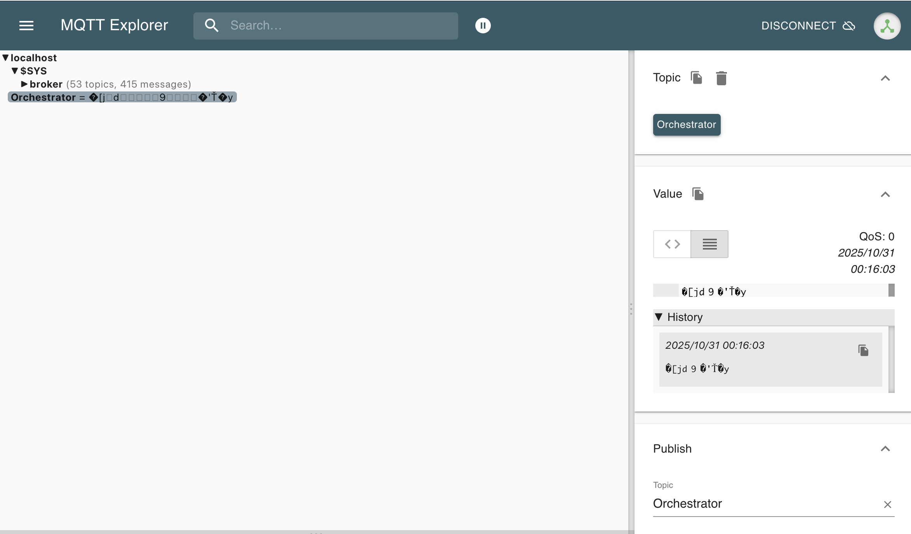

# Installation of GRAMSBallloon

## Prerequisite Software

- ANLNext
  - Modular analysis framework developed by Hiro Odaka
  - git repository: <https://github.com/odakahirokazu/anlnext>
- CMake
- Boost
- A C++ compiler supporting C++17
- ruby (version 3.0 or later)
- SWIG
- mosquitto (<https://mosquitto.org/>)

## Procedure

1. Install Boost, CMake, ruby, SWIG, and mosquitto.

   `sudo apt install libboost-all-dev ruby-3.0-dev swig mosquitto` (ubuntu/debian)

   `brew install boost ruby swig mosquitto` (Mac, via Homebrew)

   Note: For installing mosquitto into ubuntu/debian, you may need to build from source instead of using apt. Mosquitto library on the hub computer is installed by building from source.

2. Install ANLNext

   `git clone https://github.com/odakahirokazu/anlnext.git`

   `cd anlnext`

   `mkdir build && cd build`

   `cmake ..` (NOTE: If you encounter errors due to missing ruby config path, specify it by `-DRUBY_CONFIG_FILE_DIR`. For linux, it is usually `/usr/include/(architecture)/ruby-(version)`.)

   `make`

   `make install`

    If you installed ANL Next into the $HOME directory (default destination), you need to set the following environment variables:
    (example for bash/zsh)

    `export RUBYLIB=${HOME}/lib/ruby:${RUBYLIB}`

    Otherwise, you need to set the following environment variables:

    `export ANLNEXT_INSTALL=/path/to/install`

    `export RUBYLIB=${ANLNEXT_INSTALL}/lib/ruby:${RUBYLIB}`

    In addition, Mac users before El Capitan may need to set:

    `export DYLD_LIBRARY_PATH=${ANLNEXT_INSTALL}/lib:${DYLD_LIBRARY_PATH}`

    Or Linux users may need this:

    `export LD_LIBRARY_PATH=${ANLNEXT_INSTALL}/lib:${LD_LIBRARY_PATH}`

3. Check ANLNext installation

    `cd (source)/(to)/(ANLNext)/examples/simple_loop`

    `mkdir build && cd build`

    `cmake ..` (NOTE: specify the installation prefix if not using default ($HOME/lib) by CMAKE_INSTALL_PREFIX option)

    `make`

    `make install`

    `cd ../run`

    `./run_simple_loop.rb`

    If everything is OK, you will see the output like below:

    ```plain
    
    ######################################################
    #                                                    #
    #          ANL Next Data Analysis Framework          #
    #                                                    #
    #    version:  2.02.02                               #
    #    author: Hirokazu Odaka                          #
    #    URL: https://github.com/odakahirokazu/ANLNext   #
    #                                                    #
    ######################################################


            **************************************
            ****          Definition          ****
            **************************************


    ANLManager: starting <define> routine.


    ANLManager: <define> routine successfully done.
    
                            .
                            .
                            .
    
    <End Analysis>   | Time: 2025-10-24 01:00:54 +0900

    Analyze() returned AS_QUIT.

        **************************************
        ****         Finalization         ****
        **************************************

    ANLManager: starting <finalize> routine.
   
    ANLManager: <finalize> routine successfully done.
    ```

4. Install GRAMSBalloon

    `git clone https://github.com/STA205233/pGramsFC`

    `cd pGramsFC`

    `mkdir build && cd build`

    `cmake ../onboard` (NOTE: specify the installation prefix if not using default ($HOME/lib) by CMAKE_INSTALL_PREFIX option)

    `make`

    `make install`

5. Check GRAMSBalloon installation
    <a name="check_gramsballoon"></a>

    Before running the example, you need to specify the mosquitto broker information by environment variables:

    ```zsh
    export PGRAMS_MOSQUITTO_HOST=your_mosquitto_broker_address
    export PGRAMS_MOSQUITTO_PORT=your_mosquitto_broker_port
    export PGRAMS_MOSQUITTO_USER=your_mosquitto_username
    export PGRAMS_MOSQUITTO_PASSWD=your_mosquitto_password
    ```

    And, you have to run mosquitto broker somewhere (locally or on another PC).

    Example: `brew services start mosquitto` (Mac, via Homebrew)

    Then, go to the examples directory:

    `cd (source)/(to)/(pGramsFC)/examples/`

   ### A. DAQ Computer communication example (for onboard system)

      Before running this example, you may need to change the serial port setting by modifying [network.cfg](../settings/network.cfg)

      This file is written like below:

      ```ini
        [Orchestrator]// Subsystem name

        ip="localhost" // IP address of the server (Usually localhost)
        telport=50000 // Telemetry port
        comport=50001 // Command port
        comtopic="Orchestrator" // Command topic
        teltopic="Orchestrator_Telemetry" // Telemetry topic
        iridiumteltopic="Orchestrator_Iridium_Telemetry" // Iridium telemetry topic
      ```

      And you have to specify subsystem which you want to enable in `DAQ_Com_communication.rb`. Specified subsystem in network.cfg should be same as this.

      ```ruby
      subsystems = ["Orchestrator", ] # Specify subsystems to enable
      ```

      And Run ID information is written and read from `~/settings/run_id/run_id_onboard.txt` by default. You may need to create this file before running the example. (You can change this path by modifying `DAQ_com_communication.rb` in line 29.)

      Then, run the example:

      `cd DAQ_com_communication`

      `./DAQ_com_communication.rb`

   ### B. Interpret Telemetry example (for ground system)

      Before running this example, you may need to change the mosquitto broker information by modifying `pGramsFC/settings/network.cfg` (See above).

      Then, run the example:

      `cd interpret_telemetry`

      `./interpret_telemetry.rb`

   ### C. Send Command example (for ground system)

    Command sending software is different from the main software. You need to build it separately. The software requires Boost and Mosquitto libraries.

    `cd (source)/(to)/(pGramsFC)/command_sender/`

    `mkdir build && cd build`

    `cmake ..`

    `make`

    Then, run the executable. Currently only raw command sending is supported for pGRAMS:

    `./send_command_raw (subsystem_name) (command code in decimal) (parameter1 in decimal) (parameter2 in decimal) ...`

    Subsystem name should be same as specified in [network.cfg](../settings/network.cfg). CRC and Argc are automatically calculated and added to the command.

    Example (Sending command code 0x64 (100 in decimal) with arguments 57, 2 to the Orchestrator subsystem):

    `./send_command_raw Orchestrator 100 57 2`

    NOTE: Please make sure that the MQTT broker is running and its IP address, port, username, and password are correctly set in the environment variables before running the examples.

    If you have MQTT-Explorer, you can monitor the topics and messages being sent and received. (The command is sent in binary format, so you may not be able to read it directly, but you can confirm that the message is being sent.)

    
