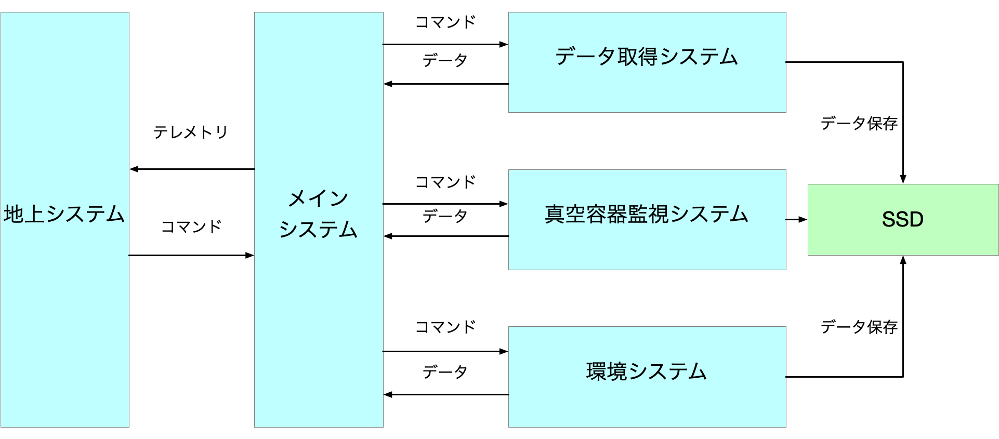

# GRAMS工学気球実験ソフトウェア仕様書

## 目的

GRAMS工学気球実験においてテレメトリ・コマンドシステムからの情報の送受信を正常に行い、光電子増倍管 (以下PMT) 、電子読み出し装置のデータ取得を行う。さらに、加速度、温度といった環境データを取得しQuick Look(QL) 及び記録することで、今後の実験に生かせるようにする。

## 機能

主にこのソフトウェアの行う機能を下に挙げる。

- メインシステム
- データ取得
- 真空容器内のデータの取得、送信
- 環境データの取得、送信
- 地上システム

このソフトウェアの概要を図1に示す。これらの機能は同時に動かし (マルチスレッド) 、それぞれが連携できるようにする。この実装はANLNextを用いてチェーンとして各ブロックを実装する。

### メインシステム

これ以外のすべてのシステムを起動、監視するプログラム。図2にメインシステムのフローチャートを示す。それぞれのプログラムをプロセスとして起動し、終了シグナルを地上系から受け取った際にはプロセス間通信にて終了シグナルを送る。プロセス間通信にて受け取ったデータを地上系に流す。シリアル通信のプロトコルはUARTを使用する。

### データ取得システム

データ取得システムについては早稲田大学の中島さんが構築を行っており、詳しくは述べないが、データ取得システムが正常に動作していることを確認できるようにするため、カウントレート情報をメインシステムに逐一送信する。

### 真空容器監視システム

圧力、温度、液面、電圧など真空断熱容器に直接関係するデータを処理する。これらのデータはSSDに保存され、地上系にも送信する。

### 環境システム

温度や加速度、湿度といった検出器系に直接関連しないデータを処理する。そして、それらのデータをSSDに保存する。一部のデータは地上系にも送信する。

### 地上システム

地上から気球に向けて、コマンドを取得し、テレメトリを受信する。

## 保存データ構造

### 検出器から得られたデータ

検出器から得られた情報はcsv形式として保存する。データの例を下に示す。

`Time,Accx,Accy,Accz,Temp1,Temp2`\
`2023-05-20T045523.113442,0.142,0.332,9.805,30.4,30.2`\
`2023-05-20T045523.127651,0.523,0.422,8.430,30.6,31.0`\
`2023-05-20T045523.132234,0.346,0.234,6.542,31.4,32.1`\
`...`

### 環境システムからのデータ

環境システムから得られたデータはCSV形式にて保存する。データの例を下に示す。列は取得時刻、$x,y,z$方向の加速度、温度のように並んでおり、行ごとに1タイムスタンプを表す。

`Time,Accx,Accy,Accz,Temp1,Temp2`\
`2023-05-20T045523.113442,0.142,0.332,9.805,30.4,30.2`\
`2023-05-20T045523.127651,0.523,0.422,8.430,30.6,31.0`\
`2023-05-20T045523.132234,0.346,0.234,6.542,31.4,32.1`\
`...`

## 通信データ構造

### テレメトリデータ

テレメトリデータとして送信するものは以下の表のようにする。
<table>
    <tr>
        <th>種類</th><th>名前 </th><th>優先度</th><th>データ型</th><th>データ量</th><th>説明</th>
    </tr>
    <tr>
        <th colspan=1>開始コード</th>
        <td></td>
        <td>1</td>
        <td>char</td>
        <td>2 byte</td>
        <td>通信の開始を表すコード</td>
    </tr>
    <tr>
            <th rowspan=2>Header</th>
        <td>時刻</td>
        <td>1</td>
        <td>int</td>
        <td>4 byte</td>
        <td>UNIX時間の下4桁を表示する</td>
    </tr>
    <tr>
        <td>カウント</td>
        <td>1</td>
        <td>int</td>
        <td>4 byte</td>
        <td>何番目のテレメトリかを表す</td>
    </tr>
    <tr>
        <th rowspan=4>真空断熱容器</th>
        <td>カウントレート</td>
        <td>1</td>
        <td>int</td>
        <td>4 byte</td>
        <td>データ取得のカウントレート</td>
    </tr>
    <tr>
        <td>圧力</td>
        <td>1</td>
        <td>unsigned int16</td>
        <td>2 byte</td>
        <td>圧力データ</td>
    </tr>
    <tr>
        <td>液面</td>
        <td>1</td>
        <td>unsigned int16</td>
        <td>2 byte</td>
        <td>液面データ</td>
    </tr>
    <tr>
        <td>容器内温度</td>
        <td>1</td>
        <td>int16</td>
        <td>2 byte x 3</td>
        <td>真空断熱容器内の温度</td>
    </tr>
    <tr>
        <th rowspan=6>HKデータ</th>
        <td>環境系温度</td>
        <td>2</td>
        <td>int16</td>
        <td>2 byte x 2</td>
        <td>耐圧容器内の温度</td>
    </tr>
    <tr>
        <td>CPU温度</td>
        <td>1</td>
        <td>int16</td>
        <td>2 byte</td>
        <td>Raspberry PiのCPU温度</td>
    </tr>
    <tr>
        <td>湿度</td>
        <td>3</td>
        <td>unsigned int16</td>
        <td>2 byte</td>
        <td>耐圧容器内の湿度</td>
    </tr>
    <tr>
        <td>気圧</td>
        <td>3</td>
        <td>unsigned int16</td>
        <td>2 byte</td>
        <td>耐圧容器内の気圧</td>
    </tr>
    <tr>
        <td>加速度</td>
        <td>2</td>
        <td>int</td>
        <td>4 byte x 6</td>
        <td>加速度、角速度</td>
    </tr>
    <tr>
        <td>電流値</td>
        <td>1</td>
        <td>int16</td>
        <td>2 byte x 5</td>
        <td>特定の場所の電流値</td>
    </tr>
    <tr>
        <th rowspan=2>Footer</th>
        <td>CAB (Command Answer Back)</td>
        <td>1</td>
        <td>char</td>
        <td>2 byte</td>
        <td>最後に受け取ったコマンド</td>
    </tr>
    <tr>
        <td>md5</td>
        <td>1</td>
        <td>string</td>
        <td>16 byte</td>
        <td>開始コード以降のハッシュ値</td>
    </tr>
    <tr>
        <th colspan=1>終了コード</th>
        <td></td>
        <td>1</td>
        <td>char</td>
        <td>2 byte</td>
        <td>通信の終了を表すコード</td>
    </tr>
    <tr>
        <th>合計</th>
        <td>8データ</td>
        <td></td>
        <td></td>
        <td>104 byte</td>
        <td></td>
    </tr>
</table>

### コマンドデータ

コマンドデータは以下の表のようにする。
<table>
    <tr>
        <th>名前</th>
        <th>データ型</th>
        <th>データ量</th>
        <th>説明</th>
    </tr>
    <tr>
        <td>開始コード</td>
        <td>char</td>
        <td>2 byte</td>
        <td>コマンドの始まりを表すコード</td>
    </tr>
    <tr>
        <td>コマンドの行先</td>
        <td>char</td>
        <td>1 byte</td>
        <td>どのシステムに対するコマンドなのかを指定する</td>
    </tr>
    <tr>
        <td>引数</td>
        <td>char</td>
        <td>1 byte</td>
        <td>コマンドの引数を指定する</td>
    </tr>
    <tr>
        <td>終了コード</td>
        <td>char</td>
        <td>2 byte</td>
        <td>コマンドの終わりを表すコード</td>
    </tr>
</table>

コマンドの行先については次の表のように表す。
<table>
    <tr>
        <th>システム名称</th>
        <th>コード</th>
    </tr>
    <tr>
        <td>メインシステム</td>
        <td>m</td>
    </tr>
    <tr>
        <td>データ取得システム</td>
        <td>d</td>
    </tr>
    <tr>
        <td>真空容器内監視システム</td>
        <td>c</td>
    </tr>
    <tr>
        <td>環境システム</td>
        <td>e</td>
    </tr>

</table>
